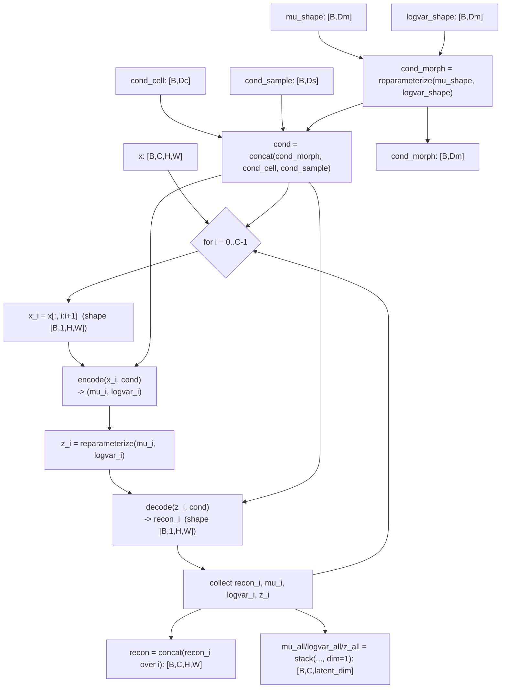
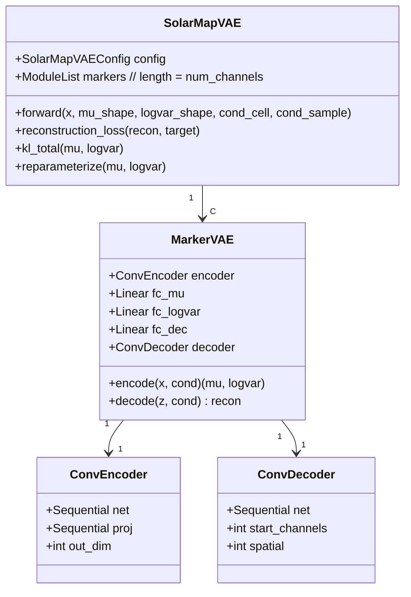
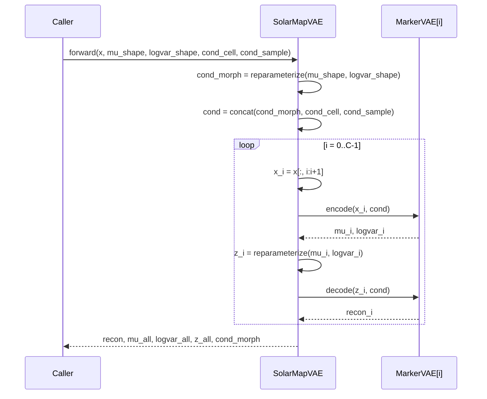

# SOLAR Map VAE (Stage 2): `SolarMapVAE`

This document describes the architecture of SOLAR’s Stage 2 model, `SolarMapVAE`, which learns **localization maps** (where each organelle/marker tends to appear) conditioned on cell morphology (Stage 1) and optional covariates.

Relevant code:
- Model: `solar/models/solar_map_vae.py`
- Training: `solar/train/train_solar_map_vae.py`
- Shape test: `tests/test_solar_map_vae_forward.py`

---

## What the model does

`SolarMapVAE` is a conditional VAE that reconstructs a multi-channel map tensor:

- Input maps: `x` with shape `[B, C, H, W]`
- Output maps: `recon` with shape `[B, C, H, W]`

Key design choice: **one VAE per marker/channel**.
Each marker `i` has its own encoder/decoder and its own latent `z_i`, but all markers share the same conditioning vector `cond`.

---

## Inputs and conditioning

Forward signature:

- `x`: `[B, C, H, W]` (low-res localization maps)
- `mu_shape`: `[B, Dm]` (shape latent mean from Stage 1)
- `logvar_shape`: `[B, Dm]` (shape latent log-variance from Stage 1)
- `cond_cell`: `[B, Dc]` (optional per-cell covariates; can be zero-dim)
- `cond_sample`: `[B, Ds]` (optional per-sample covariates; can be zero-dim)

Condition construction:

1. Sample morphology code:
   - `cond_morph = reparameterize(mu_shape, logvar_shape)` with shape `[B, Dm]`
2. Concatenate:
   - `cond = concat(cond_morph, cond_cell, cond_sample)` with shape `[B, Dm + Dc + Ds]`

This `cond` is used for every marker VAE in the same forward pass.

---

## High-level dataflow (Mermaid)

---

## Module breakdown

`SolarMapVAE`:
- Holds `C = num_channels` independent `MarkerVAE` modules in a `ModuleList`.
- Builds a single conditioning vector `cond` per batch.
- Iterates over markers, running encode → sample → decode per channel.

`MarkerVAE` (per marker/channel):
- Encoder: `ConvEncoder` mapping `[B,1,H,W] → [B, hidden_dim]`
- Posterior heads:
  - `mu_i = Linear([hidden_dim + cond_dim] → latent_dim)`
  - `logvar_i = Linear([hidden_dim + cond_dim] → latent_dim)`
- Decoder stem:
  - `fc_dec = Linear([latent_dim + cond_dim] → encoder.out_dim)`
- Decoder: `ConvDecoder` mapping `[B, encoder.out_dim] → [B,1,H,W]`

---

## Class relationships (Mermaid)

---

## Encoder details: `ConvEncoder`

`ConvEncoder` consists of `num_blocks` strided conv blocks:

For block `i = 0..num_blocks-1`:
- `Conv2d(ch, base_filters * 2^i, kernel_size=3, stride=2, padding=1, bias=False)`
- `BatchNorm2d`
- `LeakyReLU(0.2)`

Then:
- Flatten
- `Linear(out_dim → hidden_dim)`
- `ReLU`

The spatial size shrinks by `2^num_blocks`.

---

## Decoder details: `ConvDecoder`

`ConvDecoder` reshapes a vector back to a feature map and upsamples with `num_blocks` transpose conv blocks:

- Reshape to `[B, start_channels, spatial, spatial]`
- Repeat `num_blocks` times:
  - `ConvTranspose2d(ch, out_ch, kernel_size=4, stride=2, padding=1)`
  - `ReLU`
- Final `Conv2d(ch, 1, kernel_size=3, padding=1)` to produce a single-channel output.

---

## Forward pass sequence (Mermaid)

---

## Outputs and tensor shapes

- `recon`: `[B, C, H, W]`
- `mu_all`: `[B, C, latent_dim]`
- `logvar_all`: `[B, C, latent_dim]`
- `z_all`: `[B, C, latent_dim]`
- `cond_morph`: `[B, Dm]`

---

## Losses and training notes

The model provides:
- Reconstruction loss: MSE computed only on pixels inside the per-cell mask.
- KL (total): standard Gaussian KL aggregated across dimensions and averaged

The training loop typically uses:
- `loss = rec + beta * kl`
- `beta` can warm up over steps and optionally cycle
- optional “free bits” can clamp KL per dimension
- Training must be run with masks exported and a `mask_key` provided (e.g. `mask128_path`).

---

## Sanity checks

Recommended checks after changes:
- Unit test: run `tests/test_solar_map_vae_forward.py` and ensure output shapes match expectations.
- Overfit smoke test: train on a tiny subset and verify recon error decreases.
- Masks: confirm masks load correctly and masked recon loss decreases on a tiny subset.
- Visualization: log input vs recon vs abs error montages for a few validation cells.
