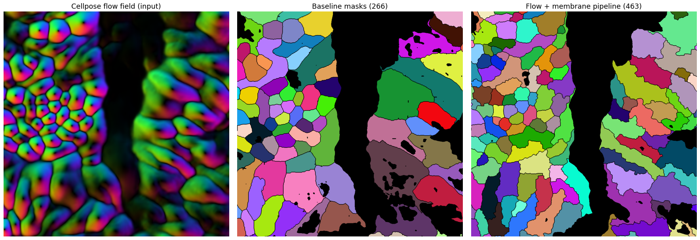

# Flow + Membrane Segmentation

A refinement step for Cellpose cell segmentation on 2-channel (nucleus + membrane)
tissue images such as MIBI. It takes a Cellpose flow field and rebuilds cleaner
instance masks by letting each signal do only what it is reliable at.



*Left: the Cellpose flow field (input). Middle: baseline masks — note the merged
blobs and interior holes. Right: this pipeline — touching cells split apart, holes
removed, boundaries snapped onto the membrane.*

---

## What it does

Standard Cellpose reconstruction can merge touching cells and leave masks with holes
or ragged edges, especially where the flow is weak. This pipeline fixes that by
combining four signals:

- **Flow divergence → cell centers.** Robust even where the membrane is dim.
- **Membrane wall → boundaries where a wall exists.** Snaps edges onto real signal.
- **Flow separatrix → boundaries where the membrane is absent.** Avoids arbitrary guesses.
- **Membrane veto → removes false splits.** Merges neighbours with no wall between them.

On top of that it also **removes junk masks**: masks with interior holes are deleted,
keeping only clean, solid cells.

## Capabilities

- Splits touching cells that Cellpose merged, using membrane boundaries + flow.
- Places boundaries on the real membrane where it exists, and on the flow separatrix
  where it does not.
- Removes masks that have interior holes (`hole_ratio`).
- Optional veto-merge to undo false splits (`use_veto`; on for whole cells).
- Exports masks as `.npy` and `.tif`, plus a per-cell confidence table (`.csv`).
- Runs on a single file or a whole folder.

## How it works (one pass)

```
Cellpose flow (_seg.npy)
        │
        ├─ divergence ─────────► cell-center seeds (h-maxima)
        ├─ membrane wall ─┐
        ├─ flow separatrix ┼──► watershed elevation ──► watershed ──► masks
        │                 │
        ├─ membrane veto ──────► merge false splits
        └─ hole removal ───────► delete masks with holes
```

Input is a Cellpose `*_seg.npy` (contains the image and the flow field).
Output is an instance-label mask.

## Usage

**One file or a folder, from the command line:**

```bash
python flow_membrane_seg.py /path/to/seg_folder -o out_dir --overlay
python flow_membrane_seg.py one_tile_seg.npy   -o out_dir
```

**From Python / a notebook:**

```python
import flow_membrane_seg as fm

seg = fm.load_seg("tile_seg.npy")
params = fm.Params()                 # defaults; tune the three knobs below
labels, ctx = fm.run_pipeline(seg, params)
```

See `flow_membrane_seg_walkthrough.ipynb` for a step-by-step visual walkthrough and
knob tuning.

## Main knobs (`Params`)

| knob | meaning |
|---|---|
| `sink_h` | merge ↔ split. Lower = more cell centers accepted. |
| `flow_weight` | membrane vs flow in the boundary. Higher = trust flow more where membrane is weak. |
| `veto_wall` | merge two cells if the wall between them is weaker than this. |
| `hole_ratio` | delete a mask if it has an interior hole (closer to 1.0 = catch smaller holes). |
| `use_veto` | run the veto-merge step (on for whole cells). |

## Requirements

`numpy`, `scipy`, `scikit-image`, `tifffile` (and `cellpose` only for generating the
input `_seg.npy`).

## Notes

- Thresholds are tuned on example FOVs; check them on a few more before trusting a
  full dataset — "big", "dim", and wall strength can shift in denser or sparser tissue.
- Designed for whole-cell segmentation on nucleus + membrane data.
