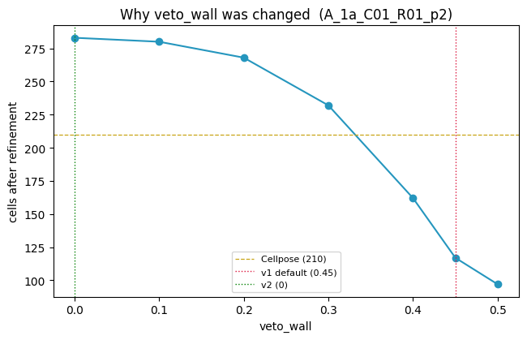
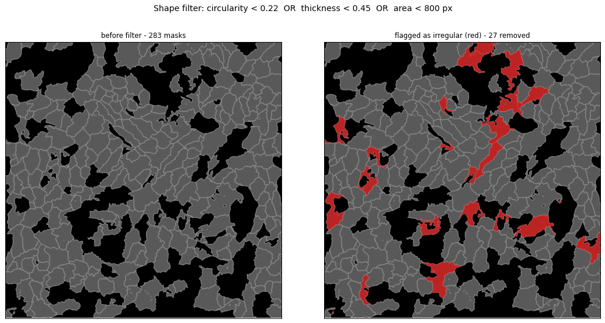
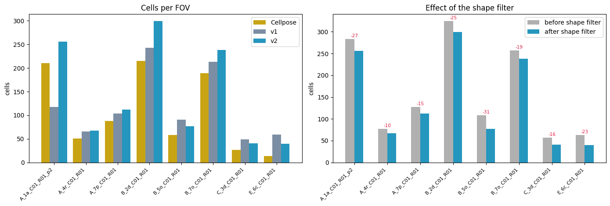
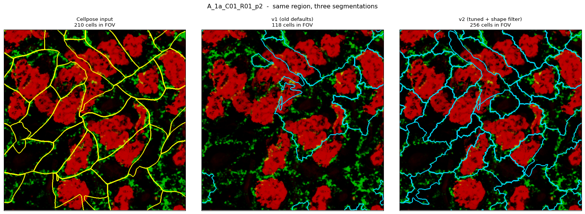

# What I did: flow-membrane refinement v2

**Date:** 2026-09-01
**Outcome:** new pipeline `flow_membrane_seg_v2.py`, tuned and with a shape filter.
v1 is unchanged on disk and still reproducible.

---

## 1. The problem I started with

The v1 refinement was destroying good cells. On `A_1a_C01_R01_p2` Cellpose found
210 cells and v1 returned 118. Across the whole 149-FOV run, matching the two
segmentations cell-by-cell showed **45% of Cellpose cells had no counterpart** in the
refined output.

## 2. Finding the cause

Instead of guessing at parameters, I counted cells after **each stage** of the
pipeline on 4 FOVs:

| stage | cells |
|---|---|
| Cellpose input | 915 |
| flow sinks (seeds) | 1281 |
| after watershed | 1275 |
| after `remove_small_objects` | 1258 |
| **after `veto_merge`** | **636** ← 49% lost here |
| after `remove_holey` | 576 |

So seeding was healthy — the watershed found *more* cells than Cellpose. The
**veto-merge step** was deleting half of them in one go. The hole filter was only
costing 9%.

## 3. Why `veto_wall` was wrong



`veto_merge` merges two neighbouring cells when the mean membrane signal along their
shared border is below `veto_wall`. Sweeping it:

| `veto_wall` | cells | vs Cellpose |
|---|---|---|
| 0.00 | 1175 | 128% |
| 0.20 | 1118 | 122% |
| 0.30 | 973 | 106% |
| **0.45** (v1 default) | **576** | **63%** |

The collapse between 0.30 and 0.45 happens because the membrane brightness on real
boundaries peaks around 0.6–0.65 — a threshold of 0.45 reaches into the bulk of that
distribution and starts treating genuine walls as absent.

**Decision: `veto_wall = 0`,** disabling merging entirely. I also settled on
`flow_weight = 0.8` (from 1) after comparing settings visually.

Things I tested and rejected along the way:

- **`veto_min_border`** — raising it looked promising, but with `veto_wall = 0` the
  merge condition never fires, so it does *nothing*. Confirmed: 316 cells at
  `veto_min_border` = 5, 20, 40 and 200.
- **`membrane_bin`** lower, to let faint membrane form boundaries — barely changed
  anything (283 cells at 0.5, 282 at 0.1). The continuous membrane term already
  carries faint signal; the binary skeleton is only a `+1` bonus on top, and at low
  thresholds the skeleton becomes a medial axis that drifts off the real wall.

## 4. The second problem: irregular masks

Some masks were clearly not cells — sprawling, branched things snaking between real
cells. Measuring shape descriptors over 687 cells:

| descriptor | 5% | 50% | 95% |
|---|---|---|---|
| solidity | 0.56 | 0.82 | 0.92 |
| circularity | 0.19 | 0.46 | 0.69 |

The important realisation: **the whole population is irregular**, not just the junk.
A sensible-looking cut like `solidity < 0.85` would have deleted 64% of cells. The
underlying cause is that the watershed climbs a speckly elevation surface, so every
mask has a crenellated outline.

### An idea I tested and dropped

Dilate/smooth each mask first, *then* measure circularity — the thought being that
this separates "ragged boundary" (an artifact) from "genuinely wrong shape".

Tested closing (r=3,5,10), closing+opening, and Gaussian-blur-and-rethreshold
(σ=2,4,6). All raise every cell's circularity but barely **reorder** them:
Spearman ρ = 0.91–0.99 against raw circularity, and the flagged bottom 5% was 24–31
of the same 33 cells. It flags what raw circularity already flags, so it isn't worth
the complexity. Reason: the junk is bad at a scale of tens-to-hundreds of pixels
(a 10 px smooth can't fix it), while the raggedness penalises all cells about
equally and cancels out of the ranking.

### What I used instead

Two descriptors, because they fail on **different** shapes:

- `circularity = 4πA/P²` — perimeter-based, catches branched sprawl
- `thickness = 2·max(distance transform) / equivalent diameter` — not perimeter-based,
  so immune to raggedness; catches thin slivers

They rank cells quite differently (ρ = 0.78; only 13/34 shared in the bottom 5%).
Circularity alone catches 21 masks on `A_1a`, thickness alone 5, area alone 6, all
three together 27 — so the overlap is small and each pulls its weight.



## 5. Final parameters

```python
fm.Params(
    veto_wall       = 0.0,     # was 0.45 - merging off
    flow_weight     = 0.8,     # was 1
    min_circularity = 0.22,    # new
    min_thickness   = 0.45,    # new
    min_area        = 800,     # new
)
```
Everything else at v1 defaults (`sink_h` 0.12, `hole_ratio` 0.99, `min_size` 80,
`div_sigma` 2.0, `mem_sigma` 1.0, `membrane_bin` 0.5, `cellprob_thr` 0.0).

## 6. Does it work?

Ran v1 and v2 over 8 FOVs spread across the folder.



| FOV | Cellpose | v1 | v2 before filter | v2 | removed |
|---|---|---|---|---|---|
| A_1a_C01_R01_p2 | 210 | 118 | 283 | 256 | 27 |
| A_4r_C01_R01 | 51 | 66 | 77 | 67 | 10 |
| A_7p_C01_R01 | 88 | 104 | 127 | 112 | 15 |
| B_2d_C01_R01 | 215 | 243 | 324 | 299 | 25 |
| B_5o_C01_R01 | 58 | 91 | 108 | 77 | 31 |
| B_7o_C01_R01 | 189 | 213 | 257 | 238 | 19 |
| C_3d_C01_R01 | 27 | 49 | 57 | 41 | 16 |
| E_6c_C01_R01 | 14 | 59 | 63 | 40 | 23 |
| **total** | **852** | **943** | **1296** | **1130** | **166** |

- v1's catastrophic losses are gone. The worst case, `A_1a`, went 118 → 256.
- The shape filter removes **12.8%** of pre-filter masks — a small, targeted cut,
  which is what I wanted. Not a reshaping of the segmentation.
- v2 ends at 1130 cells vs Cellpose's 852 (133%). Higher is expected: the point of
  the refinement is to split cells Cellpose merged.



Verification that v1 is not lost: running v2 with
`Params(veto_wall=0.45, flow_weight=1, min_circularity=0, min_thickness=0, min_area=0)`
gives 118 cells on `A_1a` — **pixel-identical** to v1.

## 7. What is still open

- **The masks are still ragged.** v2 deletes the worst shapes but does not fix the
  crenellated outlines (median circularity ≈ 0.44; a real cell should be 0.7–0.9).
  The untested fix is raising `mem_sigma` from 1.0 to 2–3 to smooth the elevation at
  source. If that is done, `min_circularity` must be re-tuned, since circularity will
  rise across the board.
- **v2 has not been run on all 149 FOVs** — only the 8 above plus tuning FOVs.
- **Whether 1130 > 852 is *correct*** is not established. Cell counts cannot tell a
  correct split from fragmentation; that needs ground truth or careful visual review.
- **Nuclear masks** (`High/nuclear/TN2/`) have not been refined. The pipeline's logic
  is membrane-driven, so it may not be the right tool there.
- `cell_table` does not report circularity/thickness per cell, so the QC csv cannot
  be used to re-check the shape filter after the fact.

## 8. Files

| file | what |
|---|---|
| `flow_membrane_seg_v2.py` | the new pipeline |
| `flow_membrane_seg.py` | v1, untouched |
| `flow_membrane_finetune.ipynb` | where the tuning was done |
| `evaluate_refinement.ipynb` | v1-vs-Cellpose evaluation that surfaced the 45% loss |
| `README.md` | how to use it |
| `fig1`–`fig4` `.png` | the figures above |
